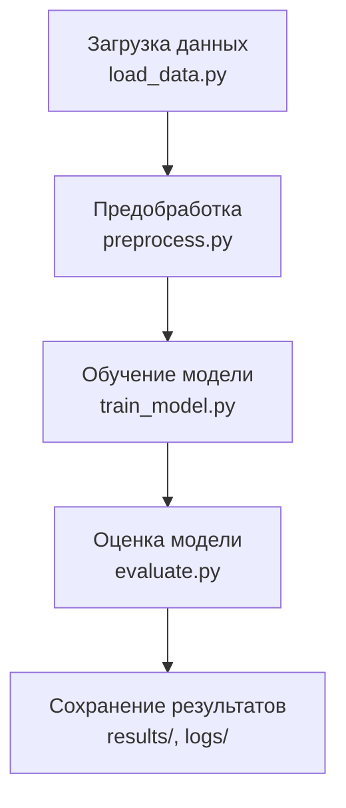
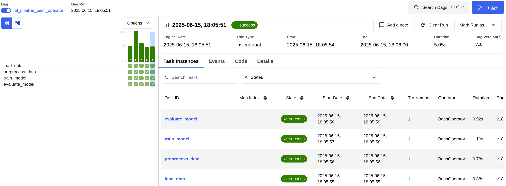

# Breast Cancer ML Pipeline: Автоматизированный ETL с Apache Airflow

## Описание проекта

Проект разработан в рамках экзамена по дисциплине "Инжиниринг данных". 

Цель — построить **автоматизированный и воспроизводимый ML-пайплайн** для классификации опухолей молочной железы (злокачественные/доброкачественные) с использованием **Apache Airflow** и **Python**.

---

## Цель и задача

Разработать ETL-процесс, включающий:
- Получение и предобработку медицинских данных (Breast Cancer Wisconsin Diagnostic).
- Обучение модели `LogisticRegression`.
- Расчет метрик (Accuracy, Precision, Recall, F1).
- Сохранение результатов в облако или локально.
- Оркестрацию всех этапов с помощью Apache Airflow.

ML-задача: **бинарная классификация** (M = злокачественная, B = доброкачественная).

---

## Архитектура проекта



---

## Структура проекта

```
├── dags/
│   └── pipeline_dag.py         # DAG-файл Airflow
├── etl/
│   ├── load_data.py            # Загрузка данных
│   ├── preprocess.py           # Предобработка
│   ├── train_model.py          # Обучение модели
│   ├── evaluate.py             # Расчет метрик
│   ├── logger.py               # Логирование
│   └── config.py               # Конфигурация путей
├── logs/                       # Логи каждого этапа
├── results/                    # Модель и метрики
├── preprocessed/               # Предобработанные данные
├── Makefile                    # Команды для CLI
├── requirements.txt            # Зависимости проекта
└── README.md                   # Документация
```

---

## Этапы пайплайна

1. **load_data.py**  
   Загружает датасет из `sklearn.datasets`, проводит базовую валидацию и сохраняет `.csv`.

2. **preprocess.py**  
   Обрабатывает данные: нормализация (`StandardScaler`), кодирование целевой переменной, сохранение результатов.

3. **train_model.py**  
   Обучает `LogisticRegression` на тренировочной выборке и сохраняет модель (`.pkl`).

4. **evaluate.py**  
   Загружает модель, предсказывает на отложенной выборке и сохраняет метрики (`.json`).

---

## Запуск пайплайна

### Через `make`:

```bash
make all        # Полный запуск
make download   # Только загрузка
make clean      # Очистка
```

### Через Airflow (bash):

```bash
airflow dags list
airflow dags trigger ml_pipeline_bash_operator
airflow tasks test download_data 2025-06-14
```

DAG ID: `breast_cancer_ml_pipeline`

---

## Обоснование архитектурных решений

Проект строится по принципам модульности, воспроизводимости и расширяемости:

- **Модульность**: каждый шаг вынесен в отдельный Python-скрипт (`load_data.py`, `preprocess.py`, `train_model.py`, `evaluate.py`), что упрощает тестирование и поддержку.
- **Конфигурация через `config.py`**: централизованное хранение путей и параметров повышает гибкость проекта.
- **Логгирование**: на каждом этапе создаётся лог, фиксирующий успешные действия и ошибки — это повышает наблюдаемость и упрощает отладку.
- **Airflow как оркестратор**: DAG обеспечивает управление зависимостями и автоматизацию запуска шагов, повторные попытки при сбое, контроль длительности и уведомления.
- **BashOperator**: выбор BashOperator упрощает интеграцию, позволяя запускать скрипты без оборачивания в PythonOperator.
- **Локальное хранилище**: модель и метрики сохраняются в `results/` для последующего анализа и возможной интеграции с облачными решениями.

Такой подход обеспечивает воспроизводимость, масштабируемость и лёгкость модификации пайплайна под разные задачи.

---

## Хранение и интеграция

Результаты (модель и метрики) сохраняются **локально**:

```
results/
├── model.pkl         # Обученная модель
└── metrics.json      # Accuracy, F1, Precision, Recall
```

Можно адаптировать под:
- Google Drive API
- Dropbox API
- Amazon S3 (`boto3` + `.env`)

---

## Анализ ошибок и устойчивости

Каждый модуль:
- имеет логирование (`logs/*.log`);
- содержит `try/except` с `logger.exception(...)`;
- проверяет наличие файлов и корректность данных.

Airflow:
- включает `retries`, `execution_timeout`, `on_failure_callback`;
- изолирует шаги (ошибка в одном — не рушит весь пайплайн);
- все шаги реализованы через `BashOperator` для воспроизводимости.

---

## Устойчивость пайплайна

Каждый модуль обернут в `try-except`, логгирует ошибки в отдельные `.log` файлы. DAG включает:

- `retries=2` — повтор задачи в случае сбоя;
- `execution_timeout=20 минут` — защита от зависания;
- `on_failure_callback` — оповещение об ошибке (можно расширить под Slack/Telegram).

### Возможные точки отказа:

| Этап           | Возможная ошибка                  | Реакция системы                            |
|----------------|-----------------------------------|--------------------------------------------|
| Загрузка       | Отсутствие `target`, NaN          | Логгирование + исключение                  |
| Предобработка  | Ошибки маппинга, пропуски         | Исключение и остановка пайплайна           |
| Обучение       | Ошибка модели, shape mismatch     | Логгирование + прерывание                  |
| Оценка         | Некорректный `model.pkl`          | Исключение, логгирование                   |

---

## Идеи для развития проекта


- Сохранять модели по дате (`model_2025-06-14.pkl`);
- Использовать `MLflow` для трекинга;
- Добавить `Great Expectations` для проверки данных;
- Интеграция с Telegram-ботом для уведомлений.

---

## Скриншот работающего DAG



---
